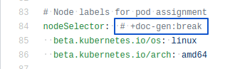
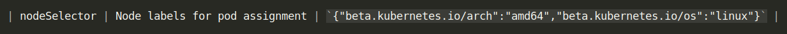
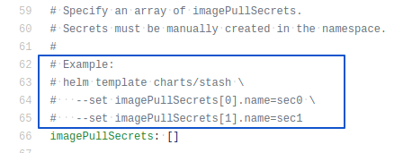
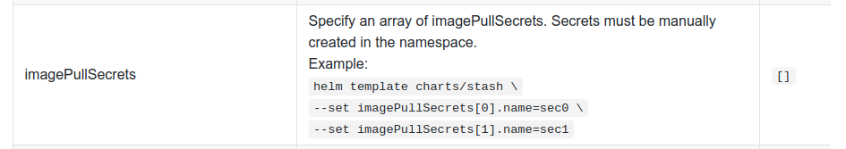

# chart-doc-gen
Helm Chart Documentation Generator

```console
$ go run *.go \
    -d=./testdata/doc.yaml \
    -v=./testdata/values.yaml > ./testdata/README.md
```

## Installation

Download the pre-built binaries from release page and copy to your $PATH directory.

## How does it work

`chart-doc-gen` takes a [doc.yaml](./testdata/doc.yaml) file and fills it with a values table auto generated from a [chart values file](./testdata/values.yaml). Then it renders to stdout a README.md file based on [readme template](./templates/readme.tpl).

`chart-doc-gen` walks a chart values file and generates a row for each leaf node in the values YAML document.
The description of each leaf node must be written above it in comments.
You can find an example generated [README.md](./testdata/README.md) from a [values file](./testdata/values.yaml).

Sometimes you may provide an object as default value for a parameter. To break out from the tree walk in that case,
add a line comment `+doc-gen:break` to the right of the parameter.




You can also add an example for `--set key=value` command in the comments. To do so, add a line `# Example:`
and write the example commands in the comments below. The example lines will be broken by `<br >` in the
generated values table.



